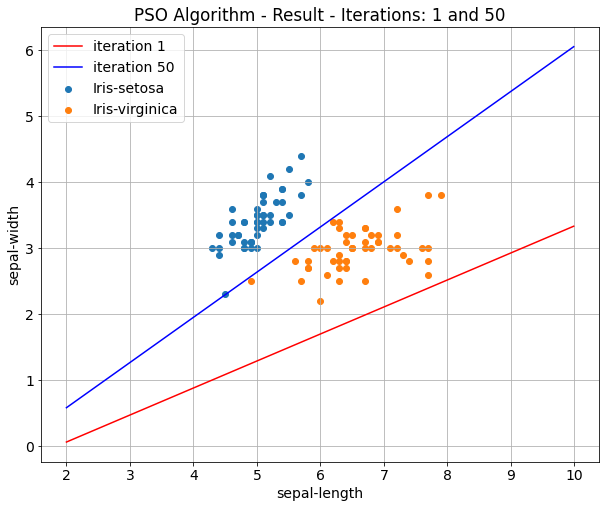

# pso_linear_combination
Particle Swam Optimization (PSO) algorithm for hyperplane optimization.
Project to get more familiar with the Scala language.

The dataset, which was used to test the PSO algorithm can be generated with the script `create_tmp_dataset.py`. A result of the algorithm is provided and can be found in the file `result.json`. Additional plots can be found in `pso_result.ipynb`.

### One possible result of the algorithm:

### References
Kennedy, J., & Eberhart, R. (1995, November). Particle swarm optimization. In Proceedings of ICNN'95-International Conference on Neural Networks (Vol. 4, pp. 1942-1948). IEEE.

Eberhart, R. C., & Shi, Y. (2000, July). Comparing inertia weights and constriction factors in particle swarm optimization. In Proceedings of the 2000 congress on evolutionary computation. CEC00 (Cat. No. 00TH8512) (Vol. 1, pp. 84-88). IEEE.
